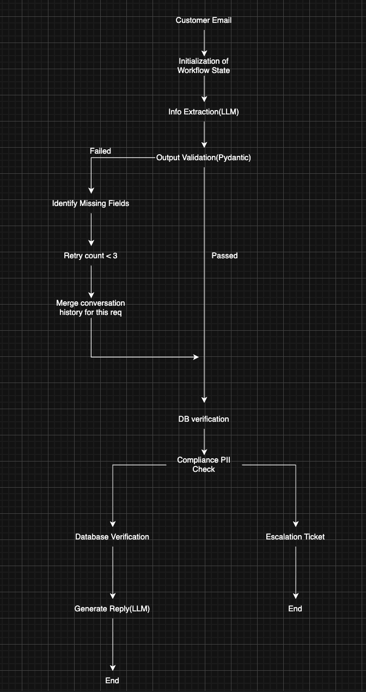

# Support & Compliance Pipeline

**Support & Compliance Pipeline** is a stateful AI workflow for processing customer billing complaint emails. It extracts structured complaint data, validates required fields, asks for clarification when information is missing, verifies billing claims against a mock database, checks for sensitive information, and then either generates a customer response or creates an internal escalation ticket.

The project is built around LangGraph and a shared `WorkflowState`, so each step can read and update the same request state as the complaint moves through the pipeline.

## Architecture Diagram



## Folder Structure

```text
Support & Compliance Pipeline/
├── graph/
│   └── workflow.py              # LangGraph state machine and route functions
├── nodes/
│   ├── extract.py               # Email to structured complaint data
│   ├── validate.py              # Required field validation
│   ├── clarify.py               # Clarification retry loop support
│   ├── verify.py                # Mock billing database verification
│   ├── compliance.py            # PII and compliance risk checks
│   ├── response.py              # Customer response generation
│   └── escalation.py            # Internal escalation ticket generation
├── state/
│   └── workflow_state.py        # Central WorkflowState model
├── sample_emails/               # Ready-to-run sample complaint emails
├── escalation_tickets/          # Saved internal escalation tickets
├── tests/                       # node-level tests
├── logger.py                    # Run log helpers
├── main.py                      # User-friendly CLI entry point
├── mock_db.py                   # Mock customer billing records
├── models.py                    # Pydantic data models
├── pii.py                       # Regex-based PII detection
├── prompts.py                   # Prompt builders
├── requirements.txt
└── README.md
```

## State Design

`WorkflowState` is the shared state object used by every node.

Important fields:

- `request_id`: auto-assigned request id used in logs, responses, and escalation tickets.
- `raw_email`: original customer complaint text.
- `conversation_history`: clarification messages generated during retries.
- `retry_count`: number of clarification attempts.
- `missing_fields`: required fields that are not available yet.
- `extracted_information`: structured data and node-added metadata.
- `validation_status`: `pending`, `passed`, `clarification`, or `failed`.
- `verification_status`: `pending`, `verified`, `mismatch`, or `not_found`.
- `compliance_status`: `pending`, `safe`, `high`, or `critical`.
- `route`: final route, usually `response` or `escalate`.
- `final_output`: customer response or internal ticket text.
- `execution_history`: chronological audit trail of node outcomes.

## Workflow Explanation

1. `extract_information` reads the raw email and extracts `customer_name`, `account_id`, `claimed_amount`, `expected_amount`, and `issue_type`.
2. `validate_extraction` checks that every required field is present and amount fields are numeric.
3. `clarify_missing_information` asks for missing details and allows up to 3 retries.
4. `verify_business_claim` checks the account, customer name, and claimed amount against `mock_db.py`.
5. `evaluate_compliance` scans the raw email for PII such as credit cards, PAN, Aadhaar, passport numbers, phones, and emails.
6. `generate_customer_response` runs only when validation passed, verification succeeded, and compliance is safe.
7. `create_escalation_ticket` handles unsafe, unverifiable, invalid, or incomplete requests.

Escalation tickets are printed as the final output and also saved as `.txt` files under `escalation_tickets/`.

## How To Run

Create and activate a virtual environment:

```bash
python3 -m venv .venv
source .venv/bin/activate
pip install -r requirements.txt
```

Run the friendly CLI with a built-in happy-path demo:

```bash
python main.py --demo happy
```

Run all built-in demo scenarios:

```bash
python main.py --demo missing_account
python main.py --demo missing_amount
python main.py --demo credit_card
python main.py --demo wrong_account
```

Process your own email:

```bash
python main.py --email "Hello, my name is Alice Johnson. My account ACC1023 was billed $120 but I expected $100."
```

Process an email from a text file:

```bash
python main.py --file complaint.txt
```

Run a sample email file:

```bash
python main.py --file sample_emails/happy_path.txt
```

Run all sample email files:

```bash
python main.py --file sample_emails/happy_path.txt
python main.py --file sample_emails/missing_account.txt
python main.py --file sample_emails/missing_amount.txt
python main.py --file sample_emails/credit_card_risk.txt
python main.py --file sample_emails/pan_risk.txt
python main.py --file sample_emails/wrong_account.txt
python main.py --file sample_emails/customer_mismatch.txt
```

Run the compiled LangGraph workflow without interactive clarification:

```bash
python main.py --demo happy --auto
```

Print the final state as JSON:

```bash
python main.py --demo happy --json
```

Run without writing a log file:

```bash
python main.py --demo happy --no-log
```

Paste an email interactively:

```bash
python main.py
```

Use the project virtual environment directly:

```bash
.venv/bin/python main.py --demo happy
.venv/bin/python main.py --demo happy --auto
```

By default, the project uses deterministic fallbacks so it works without API credentials. To enable LLM calls:

```bash
export USE_LLM=1
export LLM_API_KEY="your-api-key"
python main.py --demo happy
```

When `USE_LLM=1`, extraction and customer-response generation use the configured LLM. If the LLM package, network, API key, or model response fails, the execution history records the reason and the pipeline falls back to deterministic logic.

The CLI prints the active LLM mode and extraction engine for every run:

```text
LLM mode: enabled (nvidia/nemotron-3-ultra-550b-a55b)
Extraction engine: llm
Extracted amounts: claimed=120.0, expected=100.0
```

## Test Cases

Represented by the test suite:

- Happy Path: valid complaint routes to customer response.
- Missing Account: validation requests clarification for `account_id`.
- Missing Amount: validation requests clarification for amount fields.
- Retry Limit: clarification retries stop at 3 and route to escalation.
- Credit Card: compliance flags credit card PII as high risk.
- Wrong Account: business verification fails with `not_found`.
- Invalid JSON: extraction parse failure becomes validation failure.
- Complete End-to-End: the whole graph produces a final route and output.

Run tests:

```bash
pytest -q
```

If `pytest` is unavailable:

```bash
python -m pytest -q
```

## Future Improvements

- Build a web UI for support agents to review clarification, verification, and escalation details.
- Add human approval before sending customer responses.
- Add role-based escalation queues for billing, compliance, and support teams.
- Extend PII policy checks with redaction before logs or tickets are written.
- Add persistent workflow storage so interrupted requests can resume later.
- Add more realistic billing scenarios, including partial credits, refunds, subscriptions, and invoice periods.
