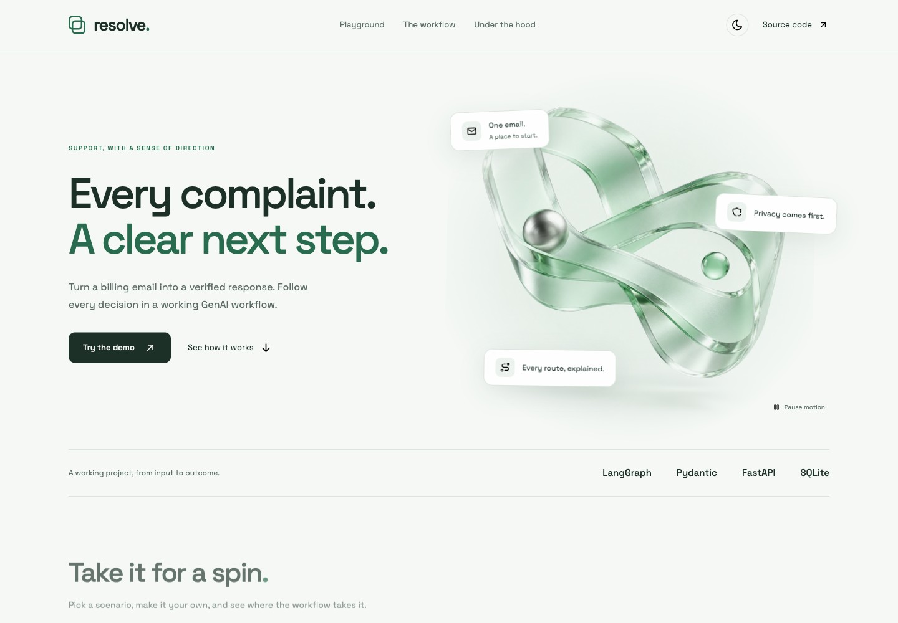
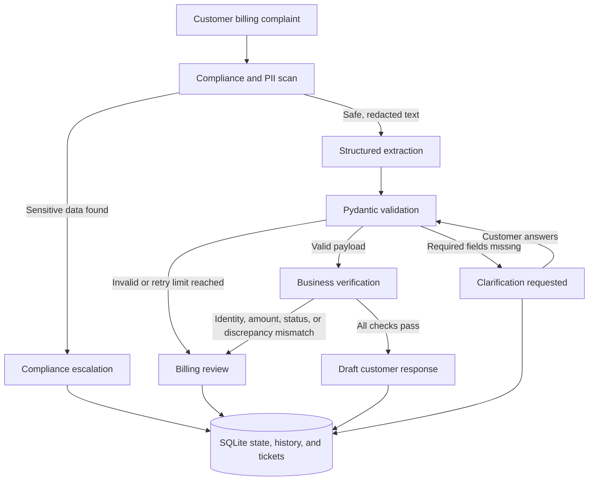

<p align="center">
  
</p>

<h1 align="center">Resolve</h1>

<p align="center">
  <strong>A stateful GenAI support and compliance pipeline for billing complaints.</strong>
</p>

<p align="center">
  Privacy first. Typed extraction. Explainable verification. A clear next step.
</p>

<p align="center">
  
  
  
  
  
  
</p>

<p align="center">
  <a href="#quick-start">Quick start</a> ·
  <a href="#how-the-workflow-runs">Workflow</a> ·
  <a href="#api">API</a> ·
  <a href="#deployment">Deployment</a>
</p>

<p align="center">
  
</p>

## What is Resolve?

Resolve is a focused portfolio project that turns a billing complaint into one of four explicit outcomes: a drafted response, a request for clarification, a billing review, or a compliance escalation.

It demonstrates where GenAI is useful and where deterministic rules should stay in control. The language model extracts structured information from a **redacted** complaint; Pydantic, business rules, and LangGraph control validation, verification, routing, and persistence.

> [!IMPORTANT]
> Sensitive-data detection runs before any external LLM call. Unsafe input is redacted and routed to compliance without entering extraction.

## Why this project stands out

| Capability | What it demonstrates |
| --- | --- |
| **Compliance-first processing** | Detects and redacts supported PII patterns before model access. |
| **Structured GenAI extraction** | Validates model output with Pydantic, versions prompts, handles failures, and falls back deterministically. |
| **Stateful clarification** | Pauses for missing details, merges the next answer, and resumes from validation without starting over. |
| **Explainable verification** | Checks identity, both amounts, account status, and discrepancy with explicit reason codes. |
| **Live workflow observability** | Streams actual node start/completion events, timings, routes, and node outputs to the browser. |
| **Simple full-stack delivery** | One FastAPI process serves the UI and API; SQLite stores state; Docker runs the complete project. |

## How the workflow runs


```mermaid
flowchart TD
    A[Customer billing complaint] --> B[Compliance and PII scan]
    B -->|Sensitive data found| CE[Compliance escalation]
    B -->|Safe, redacted text| X[Structured extraction]
    X --> V[Pydantic validation]
    V -->|Required fields missing| C[Clarification requested]
    C -->|Customer answers| V
    V -->|Valid payload| BV[Business verification]
    V -->|Invalid or retry limit reached| BR[Billing review]
    BV -->|All checks pass| R[Draft customer response]
    BV -->|Identity, amount, status, or discrepancy mismatch| BR
    CE --> S[(SQLite state, history, and tickets)]
    BR --> S
    R --> S
    C --> S
```

The graph exposes four routes deliberately, rather than hiding decisions behind a single generic “success” response:

| Route | Meaning |
| --- | --- |
| `respond` | The complaint is safe, complete, and verified. |
| `clarify` | Required information is missing; the workflow is paused and resumable. |
| `billing_review` | Business verification failed or clarification attempts were exhausted. |
| `compliance_escalation` | Sensitive information was detected before extraction. |

## Interactive demo

The browser experience is a real interface over the backend, not a scripted mock.

- Choose from verified, clarification, privacy, and account-mismatch scenarios.
- Watch the active backend node and route update through server-sent events.
- Select any completed graph node to inspect its actual output.
- Review extracted fields, compliance findings, verification checks, and activity history.
- Answer clarification questions and resume the same request.
- Reopen a persisted request, copy its output, or download its JSON state.
- Dictate a complaint with browser speech-to-text, then edit it before submission.
- Switch themes, pause motion, and navigate the result panels by keyboard.

<p align="center">
  
</p>

> [!NOTE]
> Speech recognition depends on browser support and requires HTTPS or localhost. The browser's speech provider may process audio; Resolve only receives the reviewed transcript.

## Quick start

```bash
git clone https://github.com/Tanishk237/Stateful-Support-Compliance-Pipeline.git
cd Stateful-Support-Compliance-Pipeline

python3 -m venv .venv
source .venv/bin/activate
pip install -r requirements.txt

./scripts/dev
```

Open [`http://127.0.0.1:8501`](http://127.0.0.1:8501). API documentation is available at [`/docs`](http://127.0.0.1:8501/docs).

No LLM key is required. The project starts in deterministic mode so the full demo remains usable and free to run.

If port `8501` is already occupied:

```bash
SUPPORT_PORT=8502 ./scripts/dev
```

## GenAI configuration

Copy the example environment file:

```bash
cp .env.example .env
```

```env
USE_LLM=1
LLM_API_KEY=your-api-key
LLM_MODEL=your-model-name
LLM_BASE_URL=
DATABASE_PATH=data/support_pipeline.db
```

Leave `LLM_BASE_URL` blank for OpenAI, or point it to an OpenAI-compatible provider. If configuration, networking, JSON parsing, or schema validation fails, Resolve records the extraction error and uses its deterministic fallback.

## What gets verified?

The mock billing record contains the customer identity, actual bill, expected bill, and account status. A claim reaches `respond` only when every check passes.

| Check | Example failure code |
| --- | --- |
| Account exists | `ACCOUNT_NOT_FOUND` |
| Customer identity matches | `IDENTITY_MISMATCH` |
| Claimed billed amount matches | `CLAIMED_AMOUNT_MISMATCH` |
| Expected amount matches | `EXPECTED_AMOUNT_MISMATCH` |
| Account is active | `ACCOUNT_INACTIVE` |
| Calculated discrepancy matches the record | `DISCREPANCY_MISMATCH` |

## API

| Method | Endpoint | Purpose |
| --- | --- | --- |
| `POST` | `/complaints` | Run and persist a billing complaint. |
| `POST` | `/complaints/{request_id}/clarification` | Merge missing fields and resume. |
| `GET` | `/complaints/{request_id}` | Read the latest persisted state. |
| `POST` | `/complaints/stream` | Run a complaint with live workflow events. |
| `POST` | `/complaints/{request_id}/clarification/stream` | Resume with live workflow events. |
| `GET` | `/health` | Check the API and SQLite connection. |
| `GET` | `/demo-config` | Report demo mode without exposing secrets. |

<details>
<summary><strong>Example request</strong></summary>

```bash
curl -X POST http://127.0.0.1:8501/complaints \
  -H "Content-Type: application/json" \
  -d '{
    "email": "Hello, my name is Alice Johnson. My account ACC1023 was billed $120 but I expected $100."
  }'
```

</details>

<details>
<summary><strong>Streaming event contract</strong></summary>

The streaming endpoints emit server-sent events in this order:

1. `request_started`
2. `step_started`
3. `step_completed`, including node duration and the validated state
4. `complete`, including the final persisted state

Runtime failures emit `error` without leaking the underlying exception. Validation and lookup failures remain normal HTTP errors before streaming begins.

</details>

## Architecture

```text
Browser UI
  ├── Live graph + result inspector
  ├── Editable speech transcription
  └── Same-origin REST / SSE requests
              │
              ▼
FastAPI ── ComplaintService ── LangGraph
                                  ├── compliance
                                  ├── extract
                                  ├── validate / clarify
                                  ├── verify
                                  └── respond / escalate
              │
              ▼
SQLite: workflow state + execution history + tickets
```

### Repository map

```text
├── api.py                    # REST, SSE, health, and static frontend routes
├── service.py                # Application orchestration and persistence boundary
├── persistence.py            # Lightweight SQLite store
├── graph/workflow.py         # LangGraph nodes, branches, and live event wrappers
├── nodes/                    # Compliance, extraction, validation, verification, outcomes
├── state/workflow_state.py   # Shared typed workflow state
├── models.py                 # Pydantic data contracts
├── frontend/                 # Portfolio UI: HTML, CSS, and vanilla JavaScript
├── sample_emails/            # Safe demonstration scenarios
├── tests/                    # Unit, graph, persistence, API, and streaming tests
├── scripts/dev               # One-command local launcher
└── Dockerfile                # Single-container deployment
```

## Persistence

SQLite is intentionally used to keep the demo easy to understand and deploy. The database is created automatically at `data/support_pipeline.db` with three tables:

- `workflow_states` stores the latest Pydantic state after each completed streamed node.
- `execution_history` stores ordered workflow events.
- `escalation_tickets` stores billing and compliance review tickets.

No database server or migration tool is required for this portfolio scope.

## CLI and tests

<details>
<summary><strong>CLI examples</strong></summary>

```bash
python main.py --demo happy
python main.py --demo missing_account
python main.py --demo credit_card
python main.py --file sample_emails/happy_path.txt
python main.py --demo happy --auto --json
```

</details>

Run the complete test suite:

```bash
pytest -q
```

The suite covers compliance ordering, structured extraction fallback, resumable clarification, reason-coded verification, graph routing, SQLite persistence, static assets, and REST/SSE contracts.

## Deployment

Build and run the complete website and API in one container:

```bash
docker build -t resolve-demo .
docker run --rm \
  -p 8000:8000 \
  -v resolve-data:/app/data \
  resolve-demo
```

Open [`http://localhost:8000`](http://localhost:8000). The container respects the platform's `PORT` environment variable.

For a portfolio host:

- Use `/health` as the health-check path.
- Attach a persistent volume at `/app/data`.
- Enable HTTPS for speech input.
- Store LLM credentials in host environment variables.
- Keep `USE_LLM=0` for a zero-cost deterministic showcase.
- If enabling paid model calls, add host-level rate limits and spending controls.

## Scope and safety

Resolve is a public, no-auth portfolio demonstration. It does not send email, issue refunds, or modify real customer accounts.

Use synthetic data only. Request IDs are not authorization tokens, original complaint text is persisted, the PII detector is pattern-based, and the public API is not rate-limited. Production use would require authentication, authorization, stronger secrets handling, rate limits, comprehensive data-loss prevention, audit controls, and integration with real billing and ticketing systems.

---

<p align="center">
  Built to show practical GenAI orchestration: models interpret language, typed rules make decisions, and state keeps the process explainable.
</p>
