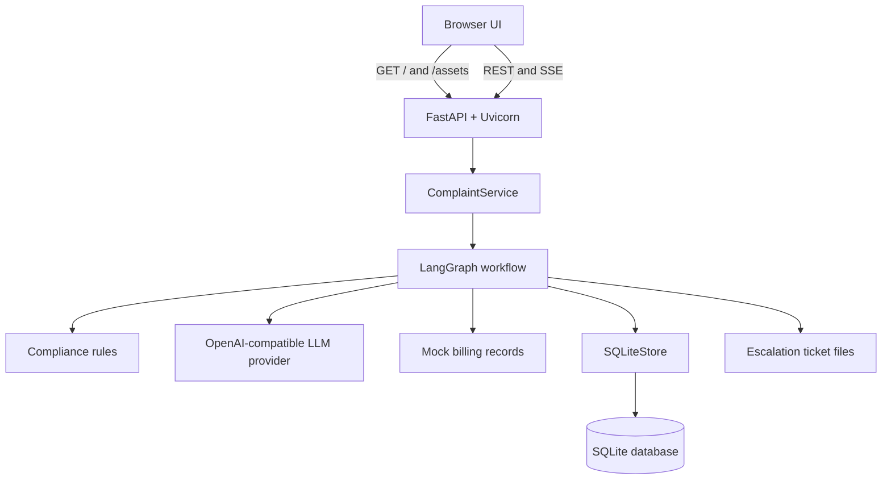
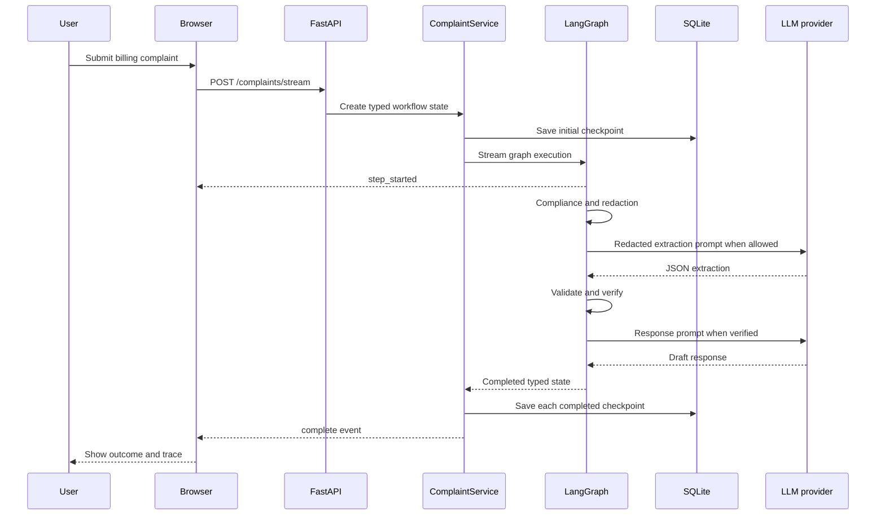
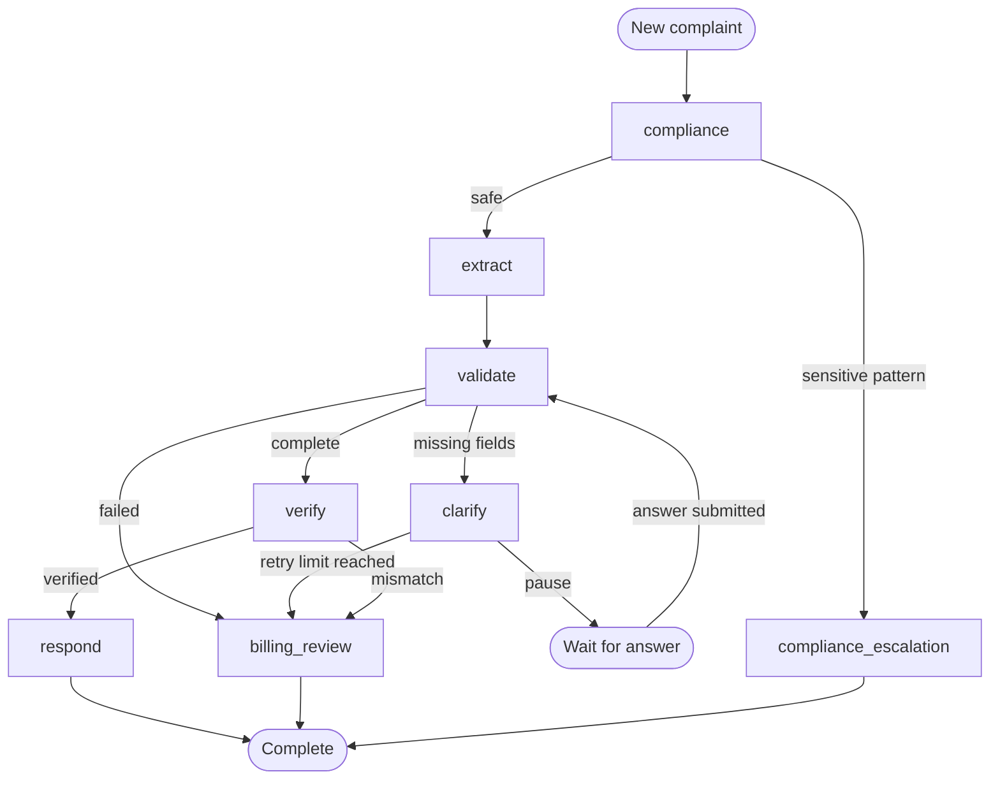

# Resolve: End-to-End Technical Guide

This guide explains the complete Resolve project: the problem it solves, how a request moves through the system, why each component exists, how the application is deployed, and how to explain the engineering decisions in an interview.

The live application is available at [resolve-support-pipeline.onrender.com](https://resolve-support-pipeline.onrender.com), and the generated API documentation is available at [resolve-support-pipeline.onrender.com/docs](https://resolve-support-pipeline.onrender.com/docs).

## Table of contents

1. [Project summary](#1-project-summary)
2. [Problem and scope](#2-problem-and-scope)
3. [Architecture](#3-architecture)
4. [Technology choices](#4-technology-choices)
5. [Repository structure](#5-repository-structure)
6. [State and data models](#6-state-and-data-models)
7. [LangGraph workflow](#7-langgraph-workflow)
8. [Compliance and privacy boundary](#8-compliance-and-privacy-boundary)
9. [GenAI extraction and response generation](#9-genai-extraction-and-response-generation)
10. [Validation and resumable clarification](#10-validation-and-resumable-clarification)
11. [Business verification](#11-business-verification)
12. [Escalation](#12-escalation)
13. [Persistence](#13-persistence)
14. [FastAPI backend](#14-fastapi-backend)
15. [Server-sent event streaming](#15-server-sent-event-streaming)
16. [Frontend](#16-frontend)
17. [Speech-to-text](#17-speech-to-text)
18. [Configuration and secrets](#18-configuration-and-secrets)
19. [Docker packaging](#19-docker-packaging)
20. [Render deployment](#20-render-deployment)
21. [Local development](#21-local-development)
22. [Testing strategy](#22-testing-strategy)
23. [Failure handling](#23-failure-handling)
24. [Security and production boundaries](#24-security-and-production-boundaries)
25. [Design decisions and tradeoffs](#25-design-decisions-and-tradeoffs)
26. [Production evolution path](#26-production-evolution-path)
27. [Interview walkthrough](#27-interview-walkthrough)
28. [Interview questions and answers](#28-interview-questions-and-answers)
29. [Five-minute demonstration script](#29-five-minute-demonstration-script)

## 1. Project summary

Resolve is a stateful support and compliance workflow for billing complaints. A customer submits a complaint in natural language, and the application turns it into one of four explicit outcomes:

- `respond`: the complaint is safe, complete, and verified, so a response is drafted.
- `clarify`: required information is missing, so the workflow pauses and asks a focused question.
- `billing_review`: business verification failed or the clarification limit was reached.
- `compliance_escalation`: supported sensitive-data patterns were detected before extraction.

The project uses an LLM where language understanding is useful, while keeping privacy checks, validation, verification, routing, retry limits, and persistence deterministic and inspectable.

### Interview elevator pitch

> Resolve is a compliance-first GenAI workflow for billing complaints. It uses LangGraph to orchestrate explicit business steps, Pydantic to validate model output and shared state, FastAPI to expose REST and streaming endpoints, and SQLite to preserve workflow checkpoints. Sensitive data is checked before extraction, missing information creates a resumable clarification loop, and verified complaints receive a generated response. The application is packaged in Docker and deployed as one full-stack Render service.

## 2. Problem and scope

Customer complaints are unstructured, but billing operations need structured and explainable decisions. A useful system must answer several questions:

1. Is it safe to process this message?
2. What customer, account, amounts, and issue are being described?
3. Is enough information present to continue?
4. Does the claim agree with the billing record?
5. Should the system respond, ask a question, or escalate?
6. Can the state be restored if the workflow pauses or fails?

Resolve addresses that sequence for one focused use case: billing complaints against a small mock billing database.

The project intentionally does not send emails, issue refunds, modify real accounts, or create tickets in an external helpdesk. Those boundaries keep the portfolio demonstration safe and understandable.

## 3. Architecture



There is one deployable application process:

- FastAPI serves the static frontend.
- FastAPI exposes the complaint API.
- `ComplaintService` coordinates graph execution and persistence.
- LangGraph executes nodes and conditional routes.
- SQLite stores state, execution history, and tickets.
- Groq is called through the OpenAI-compatible client when LLM mode is enabled.

Because the frontend calls relative paths such as `/complaints/stream`, the browser and API share one origin. There is no second frontend deployment and no cross-origin configuration.

### Request path



## 4. Technology choices

| Technology | Responsibility | Why it fits this project |
| --- | --- | --- |
| Python 3.11 | Application language | Clear data processing and mature AI ecosystem |
| FastAPI | HTTP API and static frontend hosting | Typed endpoints, generated docs, streaming responses |
| Uvicorn | ASGI server | Lightweight server for FastAPI |
| LangGraph | Stateful orchestration | Explicit nodes, conditional routing, pause and resume behavior |
| Pydantic | Runtime contracts | Validates API payloads, LLM output, and shared state |
| OpenAI Python client | Provider-independent LLM client | Works with OpenAI-compatible endpoints such as Groq |
| SQLite | Lightweight persistence | No separate database server for a portfolio demo |
| Vanilla HTML, CSS, JavaScript | Browser interface | No frontend build system or separate runtime |
| Server-Sent Events | Live workflow updates | Simple one-way event stream over HTTP |
| Docker | Reproducible packaging | Same application artifact can run locally or on a host |
| Render | Public hosting | Docker deployment, HTTPS, health checks, and free portfolio hosting |

## 5. Repository structure

```text
Stateful-Support-Compliance-Pipeline/
├── api.py
├── service.py
├── config.py
├── models.py
├── persistence.py
├── prompts.py
├── pii.py
├── mock_db.py
├── main.py
├── graph/
│   └── workflow.py
├── nodes/
│   ├── compliance.py
│   ├── extract.py
│   ├── validate.py
│   ├── clarify.py
│   ├── verify.py
│   ├── response.py
│   └── escalation.py
├── state/
│   └── workflow_state.py
├── frontend/
│   ├── index.html
│   └── assets/
│       ├── app.js
│       ├── graph.js
│       ├── speech.js
│       ├── theme.js
│       └── styles.css
├── sample_emails/
├── tests/
├── scripts/
│   └── dev
├── docs/
├── Dockerfile
├── .dockerignore
├── .env.example
└── requirements.txt
```

### Responsibility by layer

- `api.py` defines the HTTP boundary and serves the frontend.
- `service.py` is the application-service boundary shared by regular and streaming endpoints.
- `graph/workflow.py` defines node order and conditional routing.
- `nodes/` contains focused business operations.
- `state/workflow_state.py` defines the single state passed between nodes.
- `models.py` defines validated domain outputs.
- `persistence.py` owns SQLite operations.
- `frontend/` contains the browser experience.
- `tests/` verifies models, nodes, routes, persistence, API behavior, and streaming.

## 6. State and data models

### WorkflowState

`WorkflowState` is the shared state object passed through every graph node. It is a Pydantic model, so the graph does not pass loosely structured dictionaries as its primary contract.

Important fields include:

| Field | Purpose |
| --- | --- |
| `request_id` | Stable identifier for persistence and clarification |
| `raw_email` | Original submitted complaint |
| `redacted_email` | Complaint after supported sensitive patterns are replaced |
| `conversation_history` | Clarification messages exchanged during the workflow |
| `retry_count` | Number of clarification attempts |
| `missing_fields` | Required fields still needed |
| `extracted_information` | Typed LLM or fallback extraction |
| `business_verification` | Typed verification result and reason codes |
| `compliance_result` | Safety status, risk level, and detected categories |
| `customer_response` | Subject and response body |
| `escalation_ticket` | Typed ticket metadata |
| `extraction_source` | LLM, fallback, or combined provenance |
| `extraction_prompt_version` | Prompt version used for extraction |
| `extraction_error` | Captured extraction failure information |
| `resume_from_clarification` | Tells the graph to restart at validation |
| `route` | Current or final explicit route |
| `execution_history` | Ordered business events for inspection |

### Request ID

The state generates request IDs in this format:

```text
REQ-YYYYMMDDHHMMSS-XXXXXX
```

The timestamp makes requests recognizable during a demonstration, while the random suffix reduces collisions.

### ExtractedInformation

The extraction model contains:

```text
customer_name
account_id
claimed_amount
expected_amount
issue_type
```

`issue_type` is restricted to a fixed set of values. Extra fields are forbidden. This prevents a provider response from silently introducing unexpected keys into workflow state.

### BusinessVerification

This model stores each individual check rather than only a single boolean. It includes account existence, identity match, both amount matches, account status, calculated discrepancy, recorded discrepancy, and reason codes.

### ComplianceResult

This model stores:

- Whether the request is safe under the supported rules
- The calculated risk level
- The sensitive-data categories that were found

### CustomerResponse and EscalationTicket

These models keep final response and escalation outputs typed even when their text is generated dynamically.

## 7. LangGraph workflow

The graph is constructed in `graph/workflow.py`.



### Conditional entry point

A new complaint enters at `compliance`.

A resumed clarification sets `resume_from_clarification=True`, so the graph enters at `validate`. This avoids repeating compliance and extraction against the original message after the answer has already been merged into typed state.

### Node tracking

For streaming runs, every handler is wrapped by `_tracked_node`. The wrapper:

1. Emits `step_started`.
2. Records a high-resolution start time.
3. Executes the real node function.
4. Emits `step_completed` with duration and serialized state.

The UI therefore displays real execution boundaries rather than simulated progress.

### Why explicit routes matter

The route is both a business decision and a user-facing outcome. Keeping it explicit makes the graph easy to test, inspect, and explain. A generic success or failure flag would hide why the workflow stopped.

## 8. Compliance and privacy boundary

`nodes/compliance.py` is the first node for every new complaint.

It performs three operations:

1. Detect supported sensitive patterns in `raw_email`.
2. Create `redacted_email` using category placeholders.
3. Assign a risk level and route.

Supported categories in `pii.py` are:

- Credit-card-like numbers
- Indian PAN
- Aadhaar
- Passport-like values
- Phone-like numbers
- Email addresses

Examples of placeholders are:

```text
[REDACTED_CREDIT_CARD]
[REDACTED_PAN]
[REDACTED_AADHAAR]
[REDACTED_EMAIL]
```

If no supported category is detected, the status is `safe` and extraction may continue.

If a supported category is detected, the graph routes directly to `compliance_escalation`. External extraction is not called for that complaint.

### Important boundary

This is pattern-based demonstration logic, not comprehensive data-loss prevention. Names and internal demo account IDs are not classified as sensitive by the current pattern set. The response-generation prompt also receives verified structured fields. For that reason, the public application should only be used with synthetic data.

## 9. GenAI extraction and response generation

### Provider-independent configuration

The project reads four LLM settings:

```env
USE_LLM=1
LLM_API_KEY=provider-secret
LLM_BASE_URL=https://api.groq.com/openai/v1
LLM_MODEL=openai/gpt-oss-120b
```

The code uses the OpenAI Python client because Groq exposes an OpenAI-compatible API. Changing the provider normally requires configuration changes instead of rewriting business logic.

### Extraction prompt

`prompts.py` contains the versioned extraction prompt:

```text
billing-extraction-v1
```

The prompt asks for JSON with exactly five business fields and defines missing-value behavior. Prompt versioning is stored in workflow state, which improves traceability when prompts evolve.

### LLM request

The extraction call uses:

```text
temperature: 0
top_p: 0.95
max_tokens: 512
response_format: json_object
```

The low temperature makes extraction more consistent. The output cap prevents unexpectedly long responses.

### Parsing and normalization

The extraction layer:

1. Reads the model message.
2. Removes code fences when present.
3. Parses JSON.
4. Maps common provider aliases to canonical keys.
5. Parses currency-like values.
6. Normalizes the account ID.
7. Validates the result with `ExtractedInformation`.

Examples of supported aliases include `account_number` to `account_id` and `billed_amount` to `claimed_amount`.

### Deterministic fallback

If the LLM is disabled, unavailable, rate-limited, misconfigured, or returns invalid output, the node uses local regex extraction.

The fallback can identify:

- Names introduced by phrases such as “my name is”
- Account IDs such as `ACC1023`
- Currency-like numeric values
- Basic billing issue keywords

If the LLM returns a valid object but misses a field that the fallback can find, the node fills that field and records combined provenance such as:

```text
llm + fallback_fill(account_id)
```

This design keeps the demo available while preserving visibility into how the result was produced.

### Response generation

Only safe, validated, and verified complaints reach the response node.

The response prompt receives the request ID, customer name, account ID, issue type, amounts, discrepancy, and statuses. It instructs the model to remain concise and avoid promising a refund.

The response call is capped at 512 output tokens. If it fails, a deterministic response template is used.

### Maximum LLM calls per successful complaint

A fully verified complaint can make two model calls:

1. Structured extraction
2. Customer-response drafting

Compliance escalations make no extraction or response-generation call. Other branches can stop after extraction.

## 10. Validation and resumable clarification

Validation checks the five required extraction fields:

```text
customer_name
account_id
claimed_amount
expected_amount
issue_type
```

Missing text values and missing or invalid numeric values are added to `missing_fields`.

### Pause behavior

When fields are missing:

1. Validation sets the state to clarification.
2. The clarification node creates one user-facing question.
3. The retry count increases.
4. The route becomes `clarify`.
5. The graph reaches `END`, returning control to the caller.

This is a deliberate pause, not a failed request.

### Resume behavior

The clarification endpoint loads the saved state, accepts answers keyed by field name, converts numeric and account values, and merges them into `extracted_information`.

It then sets:

```text
resume_from_clarification = true
route = pending
validation_status = pending
```

The graph re-enters at validation. If the state is now complete, it proceeds to business verification.

### Retry limit

Three clarification attempts are allowed. If the required details are still missing after the allowed attempts, the request becomes a billing review.

## 11. Business verification

`mock_db.py` contains two synthetic billing records. The main UI scenario uses:

```text
Customer: Alice Johnson
Account: ACC1023
Actual bill: 120.00
Expected bill: 100.00
Status: active
```

The verification node checks:

1. Account existence
2. Case-insensitive customer-name equality
3. Claimed amount against the stored actual bill
4. Expected amount against the stored expected bill
5. Active account status
6. Calculated discrepancy against the recorded discrepancy

Currency comparisons are performed at cent precision.

### Reason codes

| Reason code | Meaning |
| --- | --- |
| `ACCOUNT_NOT_FOUND` | No record exists for the supplied account ID |
| `IDENTITY_MISMATCH` | Customer name does not match the record |
| `ACCOUNT_INACTIVE` | The account is not active |
| `CLAIMED_AMOUNT_MISMATCH` | Claimed billed amount differs from the record |
| `EXPECTED_AMOUNT_MISMATCH` | Expected amount differs from the record |
| `DISCREPANCY_MISMATCH` | Claimed discrepancy differs from the stored discrepancy |
| `VERIFIED` | Every required check passed |

The route becomes `respond` only when identity, account status, both amounts, and discrepancy all pass.

## 12. Escalation

The same escalation node handles two explicit routes:

- `billing_review`
- `compliance_escalation`

The node determines priority, department, reason, and summary from workflow state.

Examples:

- Sensitive-data findings go to the compliance department with high priority.
- Verification mismatches go to billing with medium priority.
- Exhausted clarification attempts produce a support or billing review reason.

The ticket is represented as a Pydantic model, written to an internal text file, and stored in SQLite. No external ticketing system is contacted.

## 13. Persistence

`SQLiteStore` creates three tables automatically.

### workflow_states

Stores the latest complete state snapshot:

```text
request_id
route
state_json
created_at
updated_at
```

The full state is serialized with Pydantic and upserted by request ID.

### execution_history

Stores ordered events separately for querying and inspection:

```text
request_id
step_number
step
status
details
```

When state is saved, the existing history for that request is replaced with the latest ordered history.

### escalation_tickets

Stores ticket metadata:

```text
ticket_id
request_id
route
reason
priority
department
summary
ticket_path
created_at
```

Foreign keys are enabled for each connection.

### Checkpoint behavior

For an SSE request, `ComplaintService.stream` saves:

1. The initial state
2. Every `step_completed` state
3. The final state represented by the final completed checkpoint

If streaming fails, the error event contains a safe message rather than the underlying exception. The server log retains the exception for diagnosis.

### Render persistence behavior

The hosted service uses:

```env
DATABASE_PATH=/tmp/support_pipeline.db
```

Render’s free service filesystem is ephemeral. The database and ticket files can disappear after a sleep, restart, or redeploy. That is acceptable for an interactive portfolio session, but durable production state would require an external database or persistent disk.

## 14. FastAPI backend

### Application factory

`create_app` builds the FastAPI application and optionally accepts an injected `SQLiteStore`. Store injection makes API tests independent from the default database.

The module-level statement below creates the production application:

```python
app = create_app()
```

Uvicorn refers to this as `api:app`.

### Endpoints

| Method | Path | Purpose |
| --- | --- | --- |
| `GET` | `/` | Serve the portfolio HTML |
| `GET` | `/assets/*` | Serve CSS, JavaScript, fonts, icons, and images |
| `GET` | `/health` | Check application and SQLite readiness |
| `GET` | `/demo-config` | Report whether LLM mode is enabled |
| `POST` | `/complaints` | Run and save a complaint without streaming |
| `POST` | `/complaints/stream` | Run and save a complaint with SSE events |
| `POST` | `/complaints/{request_id}/clarification` | Resume without streaming |
| `POST` | `/complaints/{request_id}/clarification/stream` | Resume with SSE events |
| `GET` | `/complaints/{request_id}` | Restore the latest saved state |
| `GET` | `/docs` | OpenAPI-based Swagger UI generated by FastAPI |

### API validation

`ComplaintCreate` requires a non-empty `email` string. The service also trims the input and rejects whitespace-only complaints.

`ClarificationCreate` accepts an `answers` object keyed by the exact missing-field names returned by the workflow.

### HTTP errors

| Status | Situation |
| --- | --- |
| `422` | Complaint input is empty or invalid |
| `404` | The request ID is not present in SQLite |
| `409` | Clarification was submitted for a request that is not waiting |
| `503` | SQLite health check failed |

## 15. Server-sent event streaming

Server-Sent Events provide a one-way HTTP stream from the backend to the browser. They are simpler than WebSockets for this use case because the client submits once and then receives progress updates.

The response uses:

```text
Content-Type: text/event-stream
Cache-Control: no-cache
X-Accel-Buffering: no
```

### Event order

```text
request_started
step_started
step_completed
step_started
step_completed
complete
```

The number of step events depends on the selected route.

### Event examples

```json
{
  "type": "request_started",
  "request_id": "REQ-20261007120000-ABC123"
}
```

```json
{
  "type": "step_started",
  "step": "compliance"
}
```

```json
{
  "type": "step_completed",
  "step": "compliance",
  "duration_ms": 1.42,
  "state": {
    "route": "pending",
    "compliance_status": "safe"
  }
}
```

```json
{
  "type": "complete",
  "state": {
    "route": "respond"
  }
}
```

### Error event

Unexpected runtime exceptions produce an SSE error event with a generic recovery message. Exception details are written to server logs rather than sent to the browser.

## 16. Frontend

The frontend uses static HTML, CSS, and JavaScript. There is no React application, npm dependency tree, bundler, or separate frontend server.

### index.html

Defines:

- The landing-page presentation
- Scenario buttons
- Complaint composer
- Live graph nodes
- Result tabs
- Clarification form
- Restore-request form
- Copy and download controls
- Theme and motion controls

### app.js

Owns application-level browser behavior:

- Loads sample complaints
- Starts complaint and clarification streams
- Parses SSE frames
- Stores the current browser-side state
- Updates the URL with the request ID
- Renders outcomes, extraction, checks, and history
- Restores a request through `GET /complaints/{request_id}`
- Copies output and downloads workflow JSON
- Reports backend and LLM-mode status

The browser aborts a stream after 180 seconds to avoid waiting indefinitely.

### graph.js

Maps backend steps to visual graph nodes. It marks nodes as running or complete, tracks the actual path, and stores completed node output for inspection.

### styles.css and theme.js

Provide the visual system, responsive layout, light and dark themes, reduced-motion behavior, and animations. Presentation preferences are stored locally; complaint data is not written to browser local storage.

### Same-origin advantage

Every browser request uses a relative URL. This provides three benefits:

1. No CORS configuration
2. No frontend API-base environment variable
3. One public URL for the complete portfolio

## 17. Speech-to-text

`speech.js` uses `SpeechRecognition` or `webkitSpeechRecognition` when supported.

The flow is:

1. The user starts recording.
2. The browser requests microphone permission.
3. Interim text is shown separately.
4. Final transcript segments are added to the editable complaint field.
5. The user reviews the text before submission.

The application backend receives text, not microphone audio. The browser or browser-selected speech provider can process the audio. Speech recognition requires a secure context such as HTTPS or localhost.

Typing remains available when speech recognition is unsupported or permission is denied.

## 18. Configuration and secrets

`config.py` calls `load_dotenv` for local development and then reads environment variables with `os.getenv`.

| Variable | Required | Purpose |
| --- | --- | --- |
| `USE_LLM` | No | Enables external LLM calls for truthy values such as `1` or `true` |
| `LLM_API_KEY` | When LLM mode is enabled | Provider secret used only by the backend |
| `LLM_BASE_URL` | For compatible providers | Overrides the OpenAI endpoint |
| `LLM_MODEL` | When LLM mode is enabled | Selects the provider model |
| `DATABASE_PATH` | No | Overrides the SQLite file location |
| `PORT` | Set by hosting platform | Selects the public server port |
| `SUPPORT_HOST` | Local launcher only | Overrides the local bind address |
| `SUPPORT_PORT` | Local launcher only | Overrides the local development port |

### Secret handling

- `.env` is ignored by Git.
- `.env` is excluded from the Docker build context.
- The API key is stored in Render environment settings.
- The frontend does not receive the key.
- `/demo-config` returns only an enabled boolean.

Changing a Render environment variable requires a deploy or restart because `config.py` reads values when the Python process imports the module.

## 19. Docker packaging

The Dockerfile is:

```dockerfile
FROM python:3.11-slim

WORKDIR /app

COPY requirements.txt .
RUN pip install --no-cache-dir -r requirements.txt

COPY . .

EXPOSE 8000

CMD ["sh", "-c", "exec uvicorn api:app --host 0.0.0.0 --port ${PORT:-8000}"]
```

### Line-by-line behavior

#### Base image

```dockerfile
FROM python:3.11-slim
```

Provides a small Linux image with Python 3.11 and pip.

#### Working directory

```dockerfile
WORKDIR /app
```

Makes `/app` the location for build and runtime commands.

#### Dependency layer

```dockerfile
COPY requirements.txt .
RUN pip install --no-cache-dir -r requirements.txt
```

Copies and installs dependencies before application code. Docker can reuse this layer when source files change but requirements do not.

#### Source layer

```dockerfile
COPY . .
```

Copies the allowed build context into `/app`.

#### Port metadata

```dockerfile
EXPOSE 8000
```

Documents the local default port. It does not override the hosting platform’s runtime port.

#### Runtime command

```dockerfile
CMD ["sh", "-c", "exec uvicorn api:app --host 0.0.0.0 --port ${PORT:-8000}"]
```

Starts Uvicorn, imports `app` from `api.py`, binds to all container interfaces, and uses the platform-provided port. `exec` makes Uvicorn the main process so it receives shutdown signals correctly.

### Docker ignore rules

`.dockerignore` excludes:

- Git and agent metadata
- Local `.env`
- Local virtual environment
- Python and pytest caches
- Local SQLite files
- Generated ticket files
- Generated logs

This keeps secrets, machine-specific files, and local runtime data out of the image.

### What Docker does not do

The current Dockerfile does not:

- Run tests during the build
- Pin the base image to an immutable digest
- Create a non-root runtime user
- Separate build and runtime stages

Those are reasonable production-hardening opportunities, but they are not required to understand the portfolio deployment.

## 20. Render deployment

### Hosted service configuration

```text
Name: resolve-support-pipeline
Type: Web Service
Runtime: Docker
Plan: Free
Region: Singapore
Branch: main
Root directory: repository root
Docker context: .
Dockerfile path: ./Dockerfile
Health check: /health
Public URL: https://resolve-support-pipeline.onrender.com
```

### Build lifecycle

When a deploy is triggered, Render:

1. Fetches the selected Git commit.
2. Uses the repository root as Docker build context.
3. Applies `.dockerignore` rules.
4. Executes the Dockerfile with BuildKit.
5. Stores the resulting image in its private registry.
6. Starts a new container with configured environment variables.
7. Supplies a `PORT` value, normally `10000` for a web service.
8. Calls `/health` until the new instance is ready.
9. Routes public HTTPS traffic to the healthy container.

### What Render reads

Render reads two kinds of configuration.

From the Render service:

- Repository and branch
- Plan and region
- Docker context and Dockerfile path
- Health-check path
- Environment variables and secrets
- Deployment trigger settings

From the repository:

- Dockerfile
- `.dockerignore`
- `requirements.txt`
- Python source
- Frontend files and assets
- Every other file allowed by the build context

Render does not read local uncommitted changes, the local virtual environment, or local `.env` values.

### Source synchronization

Only committed and pushed files are available to Render. A local edit has no effect on the hosted app.

The current service was created from a repository URL through the CLI. Its service configuration reports auto-deploy enabled, but the observed deployment history has used manual deploys. A Git-provider-backed Render service is the reliable choice when every push to `main` should deploy automatically.

For a manual deployment, the workflow is:

```bash
git add .
git commit -m "describe the change"
git push origin main
RENDER_SERVICE_ID="your-service-id"
GIT_COMMIT_SHA="your-commit-sha"
render deploys create "$RENDER_SERVICE_ID" --commit "$GIT_COMMIT_SHA" --wait
```

The service ID comes from the Render dashboard, and the commit SHA comes from Git history. Neither value is an API key.

### Free-tier behavior

- The service sleeps after a period without traffic.
- A new visitor wakes it and can experience a cold start.
- The filesystem is ephemeral.
- SQLite and ticket files can reset.
- Free runtime allowance is shared by free web services in the workspace.

The service can remain deployed without a fixed expiry while the account and Render’s free-plan policy remain available.

## 21. Local development

### Setup

```bash
python3 -m venv .venv
source .venv/bin/activate
pip install -r requirements.txt
./scripts/dev
```

Open:

```text
Website: http://127.0.0.1:8501
API docs: http://127.0.0.1:8501/docs
```

### Development launcher

`scripts/dev`:

1. Resolves the project directory.
2. Requires `.venv/bin/python`.
3. Selects host `127.0.0.1` by default.
4. Selects port `8501` by default.
5. Validates the port number.
6. Checks that the address is available without killing another process.
7. Replaces the shell with one Uvicorn process.

Use another port with:

```bash
SUPPORT_PORT=8502 ./scripts/dev
```

### Local deterministic mode

No API key is required when:

```env
USE_LLM=0
```

The extraction and response nodes use deterministic fallbacks, while the rest of the graph remains identical.

### CLI demonstrations

```bash
python main.py --demo happy
python main.py --demo missing_account
python main.py --demo credit_card
python main.py --file sample_emails/happy_path.txt
python main.py --demo happy --auto --json
```

The CLI and API share workflow functions rather than implementing separate business rules.

## 22. Testing strategy

Run the complete suite with:

```bash
pytest -q
```

The tests are organized by responsibility:

| Test area | What it verifies |
| --- | --- |
| Data models | Pydantic defaults, types, and restrictions |
| Compliance | Detection, redaction, risk, and ordering |
| Extraction | Normalization, fallback, and structured models |
| Validation | Required-field detection |
| Clarification | Question generation, answer merge, and retry behavior |
| Verification | Identity, amounts, status, discrepancy, and reason codes |
| Response | Safe response generation and fallback |
| Escalation | Ticket routing, reasons, and persistence |
| Workflow graph | Conditional branches and final routes |
| Workflow state | Request IDs and event history |
| Persistence | SQLite snapshots, history, tickets, and restoration |
| API | Endpoint status codes and state contracts |
| Streaming API | SSE order, checkpoints, and errors |
| Scenario tests | End-to-end project use cases |

The FastAPI application factory accepts an injected store, allowing tests to use isolated temporary SQLite databases.

### Current deployment-test boundary

Tests are run locally. The Dockerfile currently installs pytest but does not execute the suite during image construction, and the repository does not include a CI workflow that blocks deployment on test failure.

## 23. Failure handling

### LLM disabled

The extraction and response calls raise an internal configuration error that is caught by their nodes. Deterministic fallback runs and provenance records why it was used.

### Provider failure or rate limit

Provider exceptions are caught. The workflow continues with fallback output instead of failing the entire request.

### Invalid JSON

The extraction layer attempts direct JSON parsing, then looks for a JSON object inside surrounding text. If parsing still fails, fallback extraction is used.

### Invalid schema

Pydantic rejects incompatible types or unsupported issue values. The error is recorded as extraction provenance and fallback is used.

### Missing customer information

Validation routes to clarification rather than guessing.

### Business mismatch

Verification creates explicit reason codes and routes to billing review.

### Sensitive pattern

Compliance prevents external extraction and creates a compliance escalation.

### Streaming exception

The server logs the exception and sends a safe SSE error message. The last completed checkpoint remains in SQLite while the current instance remains available.

### Database health failure

`/health` returns HTTP 503. Render treats the instance as unhealthy.

### Browser speech failure

The UI reports permission, network, audio, or unsupported-browser errors while keeping typing available.

## 24. Security and production boundaries

### Security properties demonstrated

- Secrets remain server-side.
- `.env` is excluded from Git and Docker.
- Supported sensitive patterns are checked before extraction.
- Unsafe complaints skip external extraction.
- Model output is validated before entering business logic.
- Final response requires compliance, validation, and verification to pass.
- Public errors do not include unexpected server exception details.
- SQL operations use parameterized queries.

### Current limitations

- No authentication
- No authorization
- No ownership check for request IDs
- No application-level rate limiting
- Original complaint text is persisted
- Regex-based sensitive-data detection
- Synthetic in-memory billing records
- Temporary filesystem on free Render
- No durable audit system
- No real helpdesk integration
- No outbound email integration
- No payment or refund action
- No provider circuit breaker
- No centralized metrics or tracing platform

Request IDs are identifiers, not security tokens. Anyone who knows an active request ID can attempt to retrieve it from the public API.

## 25. Design decisions and tradeoffs

### One service instead of separate frontend and backend deployments

Benefits:

- One URL
- No CORS setup
- No frontend environment configuration
- One Docker image
- Easier portfolio operation

Tradeoff:

- Frontend and backend scale together.

### SQLite instead of a managed database

Benefits:

- Minimal setup
- Easy local inspection
- Transactions and relational structure
- Clear persistence code

Tradeoff:

- Free Render storage is not durable.
- SQLite is not appropriate for horizontally scaled write-heavy production traffic.

### Deterministic rules for routing

Benefits:

- Explainability
- Testability
- Stable compliance behavior
- Clear reason codes

Tradeoff:

- Rules require maintenance as business policy evolves.

### LLM for interpretation, not final authority

Benefits:

- Natural-language flexibility
- Typed output boundary
- Business decisions remain deterministic

Tradeoff:

- Extraction quality still depends on prompt and model behavior.

### SSE instead of WebSockets

Benefits:

- Standard HTTP
- Easy proxy support
- Natural fit for one-way progress updates

Tradeoff:

- Bidirectional real-time communication would require another mechanism.

### Vanilla frontend instead of a framework

Benefits:

- No build step
- Small dependency surface
- Easy same-process hosting

Tradeoff:

- Larger interactive applications would benefit from component structure and stronger frontend typing.

## 26. Production evolution path

A sensible production migration would be incremental.

### Phase 1: Protect the public API

1. Add authentication.
2. Add request ownership and authorization.
3. Add per-user and per-IP rate limits.
4. Add request-size limits at the API model boundary.
5. Restrict allowed origins if frontend and API separate later.

### Phase 2: Make state durable

1. Replace SQLite with PostgreSQL.
2. Add database migrations.
3. Store immutable workflow events in addition to the latest state.
4. Add retention and deletion policies.
5. Encrypt sensitive fields where appropriate.

### Phase 3: Strengthen compliance

1. Replace pattern-only detection with a tested DLP layer.
2. Classify names, account identifiers, addresses, and regional identifiers.
3. Add allowlists and false-positive handling.
4. Create auditable policy versions.
5. Minimize every field sent to the model.

### Phase 4: Operationalize the LLM

1. Add provider timeouts and retries with backoff.
2. Add a circuit breaker.
3. Record token usage and model latency.
4. Add evaluation datasets for extraction accuracy.
5. Add prompt-regression tests.
6. Configure provider and application budgets.

### Phase 5: Integrate business systems

1. Replace mock billing records with a read-only billing adapter.
2. Connect escalation tickets to a helpdesk.
3. Add reviewed outbound email delivery.
4. Require human approval for financial actions.
5. Add end-to-end audit trails.

### Phase 6: Harden delivery

1. Pin dependencies.
2. Add CI for tests and security checks.
3. Run the container as a non-root user.
4. Pin the base image to a controlled version or digest.
5. Add deployment smoke tests and rollback criteria.

## 27. Interview walkthrough

### Two-minute version

> I built Resolve to demonstrate a practical boundary between GenAI and deterministic business logic. A customer submits a billing complaint through a vanilla JavaScript interface. FastAPI creates a typed workflow state and streams real execution events to the browser. LangGraph first runs a compliance node, which checks and redacts supported sensitive-data patterns before extraction. If the request is safe, an OpenAI-compatible client calls Groq and validates the JSON result with Pydantic. Missing fields pause the graph and create a resumable clarification flow. Complete requests are verified against mock billing records with explicit reason codes. Verified complaints receive a drafted response, while mismatches and privacy findings create separate escalation routes. SQLite stores the latest state, execution history, and tickets. The frontend and API are packaged in one Docker image and hosted as one Render service.

### Five engineering points to emphasize

1. **The LLM is not the decision-maker.** It interprets language; deterministic code decides routes.
2. **Compliance is enforced structurally.** The graph begins with compliance and unsafe requests cannot reach extraction.
3. **Model output is a typed boundary.** Pydantic validates and normalizes structured data.
4. **Clarification is stateful.** The request pauses, persists, accepts answers, and resumes from validation.
5. **The UI shows real execution.** SSE events come from actual graph node boundaries.

### Strong explanation of the deployment

> Render checks out the selected Git commit and builds the root Dockerfile. The image starts from Python 3.11 slim, installs requirements, copies the allowed repository files, and starts Uvicorn with the platform-provided port. `api:app` creates FastAPI, initializes SQLite, mounts frontend assets, and exposes health and complaint routes. Render waits for `/health` to return successfully, then sends HTTPS traffic to that container. Secrets are injected as environment variables and never included in the frontend.

## 28. Interview questions and answers

### Why did you use LangGraph instead of a normal sequence of functions?

The workflow has conditional branches, a pause-and-resume loop, and multiple final outcomes. LangGraph makes those transitions explicit and testable. The node functions remain ordinary Python functions, so the orchestration layer does not contain the business implementation itself.

### Why use Pydantic after requesting JSON from the model?

JSON syntax only proves that the response can be parsed. It does not prove field names, types, allowed values, or absence of unexpected fields. Pydantic turns the provider response into a validated application contract.

### How do you ensure sensitive data is not sent to extraction?

The graph starts at compliance for every new request. That node detects and redacts supported patterns. Conditional routing sends unsafe requests directly to compliance escalation, so the extraction node is unreachable on that branch.

### Is the privacy layer production-grade?

No. It demonstrates the correct architectural ordering, but the detector is regex-based and covers a limited pattern set. Production would require stronger DLP, broader data classification, policy versioning, auditing, and strict data minimization.

### What happens if Groq is unavailable?

The extraction and response nodes catch provider failures and use deterministic local fallbacks. The workflow records the extraction source so the UI can show whether the LLM or fallback produced the result.

### Why keep a deterministic fallback?

It keeps the portfolio demonstrable without a key, during provider outages, and after free-tier rate limits are reached. It also provides a predictable baseline against which LLM extraction can be compared.

### How does clarification resume?

The state is stored under a request ID. The clarification endpoint reloads it, merges answers only for the requested fields, sets a resume flag, and invokes the same graph. The graph’s conditional entry point sends resumed state directly to validation.

### Why not ask the LLM whether a billing claim is valid?

Validity depends on authoritative records and deterministic policy. The verification node compares exact customer and billing data, calculates discrepancies, and returns reason codes. This avoids treating model confidence as business truth.

### Why use SSE?

The server only needs to push progress to a client after one submission. SSE provides ordered text events over normal HTTP and is easier to operate than a bidirectional WebSocket connection for this flow.

### Why SQLite?

It provides transactions, relational tables, and simple local setup without another service. It is appropriate for the portfolio scope. The tradeoff is that free Render storage is ephemeral and SQLite does not support the desired production scaling model.

### Why is the frontend served by FastAPI?

The frontend is static and uses relative API paths. Serving it from FastAPI provides one URL, avoids CORS, removes a second deployment, and keeps the project easy to understand.

### Where is the API key stored?

It is stored in Render’s environment settings and read by the backend with `os.getenv`. `.env` is ignored by Git and Docker. The key is never embedded in browser JavaScript.

### How are token costs controlled?

Both LLM calls have a 512-output-token limit. The selected free provider adds request and token quotas. A production version should also add input-size limits, application rate limiting, usage telemetry, and provider-level spending controls.

### How do you observe what the graph did?

Each node appends a business event to `execution_history`. Streaming execution also emits real start, completion, duration, and state events. SQLite stores checkpoints, and the UI renders both the graph path and detailed result tabs.

### What would you improve first for production?

Authentication, authorization, rate limiting, durable PostgreSQL storage, stronger DLP, and immutable audit events would come before integrating real customer or billing data.

### What is the biggest architectural strength?

The strongest feature is the separation of responsibilities: the model interprets text, Pydantic defines contracts, deterministic rules validate and verify, LangGraph controls transitions, and persistence preserves the state. A failure in one layer does not silently become a business decision.

## 29. Five-minute demonstration script

### Minute 1: Introduce the problem

Say:

> Billing complaints arrive as unstructured language, but support operations need structured, safe, and explainable decisions. Resolve turns one complaint into a response, clarification, billing review, or compliance escalation.

Show the live landing page and point out that the UI and API share one deployment.

### Minute 2: Demonstrate the verified path

Select **Billing discrepancy** and run the workflow.

Point out:

- Real graph nodes become active through SSE.
- Compliance executes before GenAI extraction.
- Extraction produces a typed record.
- Verification checks identity, both amounts, status, and discrepancy.
- The final response is drafted only after every gate passes.

Open the extraction, checks, and activity tabs.

### Minute 3: Demonstrate stateful clarification

Select **Missing details** and run it.

Explain that the missing account ID causes the graph to pause rather than guess. Enter `ACC1023` and continue. Show that the request keeps the same ID and resumes from validation.

### Minute 4: Demonstrate safety and explainability

Select **Sensitive data**. Show that compliance routes to a separate ticket before extraction.

Then select **Account mismatch**. Show the billing-review outcome and `IDENTITY_MISMATCH` reason code.

### Minute 5: Explain deployment and tradeoffs

Say:

> The repository is packaged as one Python 3.11 Docker image. Render builds the Dockerfile, injects the Groq secret as an environment variable, starts Uvicorn on the platform port, and checks `/health`. FastAPI serves both the frontend and backend. SQLite keeps the demo simple, with the known tradeoff that free Render storage is temporary. For production I would add authentication, rate limits, PostgreSQL, stronger DLP, and real billing and helpdesk adapters.

Finish by opening `/docs` to show the typed API contract.
